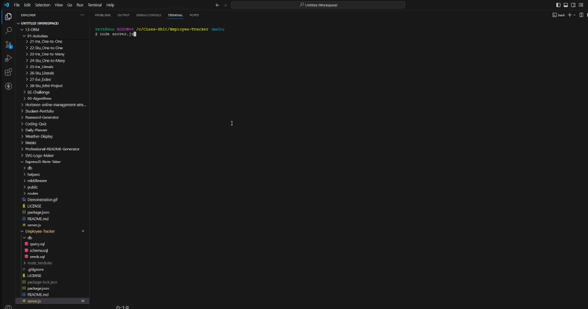

# SQL: Employee Tracker

## Description

An example of an employee database with various methods of editing/showing it

## Installation

Install Node.JS, Intall MySQL, go into the server.js file and change the password to your MySQL password, and then in your terminal navigate to the project folder and type "npm i -y" followed by "node index.js"

## Usage

Navigate through the console

## Credits

Coded By: Seth Correa (Seth the Furboi)

## License

Please refer to the LICENSE in the repo.